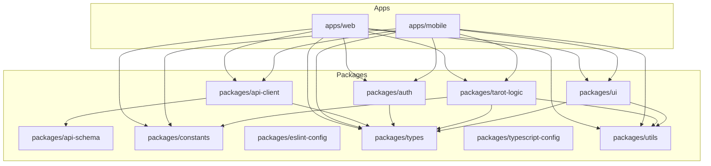

# パッケージ構成の分析

## 現状のパッケージ構成

`packages` ディレクトリ内には以下のパッケージが存在します。

*   `api-client`: API通信を行うクライアント
*   `api-schema`: APIのデータ構造定義 (おそらくZodなど)
*   `auth`: 認証関連のロジック
*   `constants`: アプリケーション全体で使われる定数 (色定義、タロットカード情報など)
*   `eslint-config`: ESLintの共通設定
*   `tarot-logic`: タロット占いのコアロジック (Web/Mobile共通？)
*   `types`: TypeScriptの型定義
*   `typescript-config`: TypeScriptの共通設定
*   `ui`: 共通UIコンポーネント (React/React Native)
*   `utils`: 汎用的なユーティリティ関数やカスタムフック

## 推定される依存関係 (Mermaid図)

*(注: 上記の依存関係はパッケージ名からの推測です)*

## パッケージ分割の目的とメリット

`apps/web` と `apps/mobile` が存在することから、このプロジェクトは**モノレポ**構成を採用していると考えられます。モノレポで `packages` ディレクトリにコードを分割する主な目的とメリットは以下の通りです。

1.  **コードの再利用:** `constants`, `types`, `ui`, `tarot-logic`, `utils` のような共通のロジックやコンポーネントを複数のアプリケーション (WebとMobile) で共有できます。これにより、コードの重複を防ぎ、一貫性を保つことができます。
2.  **関心の分離:** 各パッケージが特定の責務（UI、ロジック、型定義など）に集中することで、コードの見通しが良くなり、メンテナンス性が向上します。
3.  **独立した開発とテスト:** パッケージごとに独立して開発やテストを進めやすくなります（ただし、依存関係によっては連携が必要です）。
4.  **ビルド効率:** TurboRepoのようなビルドツールを使用している場合、変更があったパッケージとその依存関係にあるパッケージのみを再ビルドするため、ビルド時間を短縮できます。
5.  **設定の共通化:** `eslint-config` や `typescript-config` のように、設定ファイルを共通化してプロジェクト全体で一貫したルールを適用できます。

## 分割は過剰か？

「こんなに分ける必要ある？」という疑問についてですが、一概に「過剰だ」とは言えません。上記のメリットを享受するためには、ある程度の分割は自然です。特に、WebとMobileでコードを共有したい場合、共通部分をパッケージとして切り出すのは一般的なアプローチです。

ただし、以下のような場合は「分割しすぎ」かもしれません。

*   **パッケージが非常に小さい:** ほとんどコードが含まれていない、あるいは他のパッケージに含めても問題ないほど小さい場合。
*   **依存関係が複雑すぎる:** パッケージ間の依存関係が密になりすぎて、少しの変更が多くのパッケージに影響を及ぼし、かえって開発効率が低下している場合。
*   **更新が常に同時に行われる:** 複数のパッケージが常にセットで更新されるような場合、それらを一つのパッケージにまとめることを検討する余地があります。

## 結論

現状のパッケージ構成は、モノレポとしてWeb/Mobileアプリ間でコードを共有するという観点からは、**理にかなっている可能性が高い**です。各パッケージには明確な役割があるように見えます。

しかし、プロジェクトの具体的な状況（コード量、依存関係の複雑さ、開発チームの規模など）によっては、一部のパッケージを統合したり、逆にさらに分割したりする方が効率的な場合もあります。