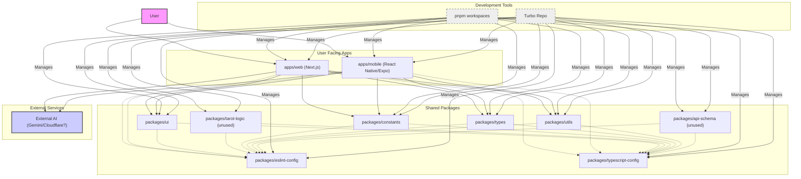
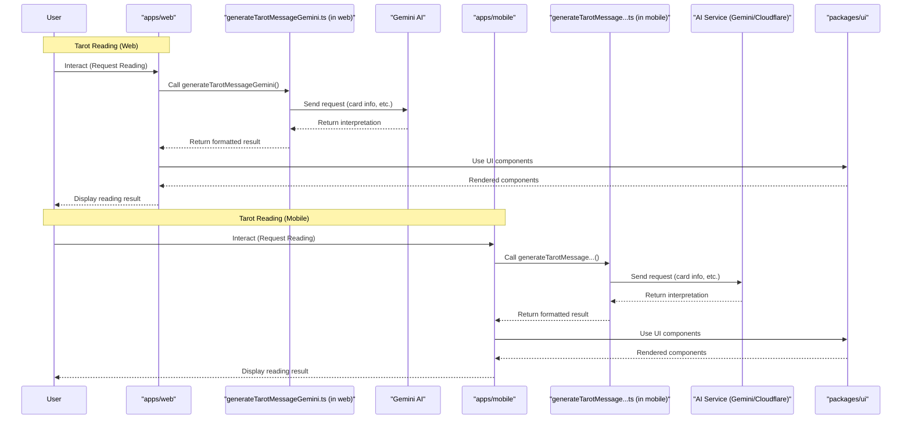

# Tarrot Monorepo

This repository contains the source code for the Tarrot application, managed as a monorepo using pnpm workspaces and Turborepo.

## Project Structure

The repository is organized as follows:

-   `apps/`: Contains the individual applications.
    -   `web`: The Next.js web application.
    -   `mobile`: The Expo (React Native) mobile application.
-   `packages/`: Contains shared packages used across applications.
    -   `api-schema`: (Currently unused) Defines the shared API schema.
    -   `constants`: Shared constants like colors, card data, etc.
    -   `eslint-config`: Shared ESLint configuration.
    -   `tarot-logic`: (Currently unused) Core Tarot reading logic. Intended for future use.
    -   `types`: Shared TypeScript types.
    -   `typescript-config`: Shared TypeScript configurations.
    -   `ui`: Shared React/React Native UI components.
    -   `utils`: Shared utility functions and hooks.

## Architecture Overview

### Diagram



### Data Flow (Sequence Diagram)



## Getting Started

### Prerequisites

-   [Node.js](https://nodejs.org/) (Version specified in `.volta` or `package.json`)
-   [pnpm](https://pnpm.io/)

### Installation

Install dependencies for all packages and applications:

```bash
pnpm install
```

### Development

Run all applications in development mode:

```bash
pnpm dev
```

This command uses Turborepo to efficiently run the development servers for both the web and mobile apps concurrently.

-   **Web App:** Typically available at [http://localhost:3000](http://localhost:3000).
-   **Mobile App:** Follow the Expo CLI instructions to open the app on a simulator or physical device.

To run a specific application or package script, use Turborepo's filtering capabilities or run the script directly within the respective directory. For example, to run only the web app:

```bash
pnpm dev --filter=@tarrot/web
```

## Building

Build all applications and packages:

```bash
pnpm build
```

## Linting and Type Checking

Lint all code:

```bash
pnpm lint
```

Check TypeScript types:

```bash
pnpm type-check
```

## Learn More

-   [pnpm Workspaces](https://pnpm.io/workspaces)
-   [Turborepo Documentation](https://turbo.build/repo/docs)
-   [Next.js Documentation](https://nextjs.org/docs) (for the `apps/web` application)
-   [Expo Documentation](https://docs.expo.dev/) (for the `apps/mobile` application)

## Troubleshooting

### Build Error: Module not found: Can't resolve './elevenlabs'

**Symptoms:**

When running `pnpm build`, the build process for the `apps/web` package fails with an error similar to:

```
@tarrot/web:build: ../../packages/constants/dist/index.js
@tarrot/web:build: Module not found: Can't resolve './elevenlabs'
```

**Cause:**

This error typically occurs when the build output (`dist` directory) of the `@repo/constants` package does not contain the expected `elevenlabs.js` file. This might happen due to stale Turborepo cache or issues with TypeScript's incremental build information (`tsconfig.tsbuildinfo`).

**Solution:**

1.  **Clean the specific package's build artifacts:** Manually remove the `dist` directory and `tsconfig.tsbuildinfo` file from the affected package (`@repo/constants` in this case).

    ```bash
    rm -rf packages/constants/dist packages/constants/tsconfig.tsbuildinfo
    ```

2.  **Rebuild the project:** Run the build command again.

    ```bash
    pnpm build
    ```

This ensures that the package is rebuilt from a clean state, resolving potential caching issues.
